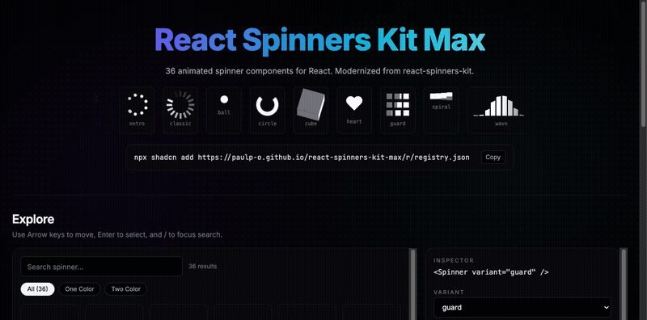

# react-spinners-kit-max

36 modern, animated spinner components for React 18+. Modernized from the classic [react-spinners-kit](https://www.npmjs.com/package/react-spinners-kit) with full TypeScript support, shadcn-compatible copy-paste installation, and CSS variable theming.

[](https://www.npmjs.com/package/react-spinners-kit-max)
[](LICENSE)
[](#testing)

<p align="center">
  
</p>

## Live Demo

See all 36 spinners in action: [Live Playground](https://paulp-o.github.io/react-spinners-kit-max/)

## What is This?

react-spinners-kit-max is a complete modernization of the classic react-spinners-kit library. The original has been unmaintained for 8 years and depends on outdated tooling (React 16, styled-components v4, Babel 6). This library brings those 36 beautiful spinner animations into the modern React ecosystem while maintaining pixel-perfect visual fidelity.

**Key features:**
- 36 handcrafted CSS-animated spinners
- Works as a shadcn-compatible copy-paste library OR a standard npm package
- Single unified `<Spinner />` component API
- Full TypeScript support
- CSS variable theming
- Accessibility-first (role=status, aria-label, prefers-reduced-motion)
- Zero external animation dependencies (pure CSS)

## Installation

### Option 1: shadcn (Copy-Paste)

```bash
npx shadcn add https://paulp-o.github.io/react-spinners-kit-max/r/spinner
```

This installs the Spinner component directly into your project's `components/ui/` directory. You control the code completely.

### Option 2: npm Package

```bash
npm install react-spinners-kit-max
```

Don't forget to import the styles:

```tsx
import "react-spinners-kit-max/style.css";
```

## Quick Start

```tsx
import { Spinner } from "react-spinners-kit-max";

export default function Loading() {
  return <Spinner variant="circle" size="lg" />;
}
```

## All 36 Spinners

| Variant | Variant | Variant | Variant |
|---------|---------|---------|---------|
| ball | grid | swap | bars |
| wave | push | firework | stage |
| heart | guard | circle | spiral |
| pulse | sequence | domino | impulse |
| cube | fill | sphere | flag |
| clap | rotate | swish | goo |
| comb | pong | rainbow | ring |
| hoop | flapper | magic | jellyfish |
| trace | classic | whisper | metro |

Try them all in the [live playground](https://paulp-o.github.io/react-spinners-kit-max/) with real-time customization.

## Props

| Prop | Type | Default | Description |
|------|------|---------|-------------|
| `variant` | `SpinnerVariant` | **required** | Which spinner animation to display (see list above) |
| `size` | `"sm"` \| `"md"` \| `"lg"` \| `"xl"` \| `number` | `"md"` | Predefined sizes or custom pixel size |
| `loading` | `boolean` | `true` | Show/hide the spinner. When false, renders nothing |
| `className` | `string` | — | Tailwind or custom CSS classes |
| `style` | `CSSProperties` | — | Inline styles (use for dynamic colors) |
| `aria-label` | `string` | `"Loading"` | Accessible label for screen readers |

## Size Mapping

Predefined sizes map to the following pixel dimensions:

- `sm` → 20px
- `md` → 40px (default)
- `lg` → 60px
- `xl` → 80px

Or pass a number directly for custom sizes:

```tsx
<Spinner variant="ball" size={32} />
```

## Color Customization

Control spinner colors via CSS custom properties:

```css
/* Primary color (all spinners) */
:root {
  --spinner-color: #3b82f6; /* Tailwind blue-500 */
}

/* Secondary color (two-color spinners only) */
:root {
  --spinner-secondary-color: #ef4444; /* Tailwind red-500 */
}
```

Or use inline styles:

```tsx
<Spinner
  variant="spiral"
  style={{
    "--spinner-color": "#3b82f6",
    "--spinner-secondary-color": "#ef4444",
  } as React.CSSProperties}
/>
```

### Two-Color Spinners

These 9 spinners support both primary and secondary colors:

- guard
- spiral
- sequence
- impulse
- cube
- swish
- trace
- whisper
- clap

Other spinners use only `--spinner-color`.

## Accessibility

react-spinners-kit-max is built with accessibility in mind:

- **Semantic HTML**: Each spinner renders as a `<div role="status">` to indicate loading state to screen readers
- **ARIA labels**: Default `aria-label="Loading"` can be customized via the `aria-label` prop
- **Prefers Reduced Motion**: Respects the `prefers-reduced-motion` media query. When enabled, spinners fade in place instead of animating

Example with custom label:

```tsx
<Spinner variant="circle" aria-label="Fetching user data..." />
```

## Tech Stack

- **React** 18+
- **TypeScript** for full type safety
- **CSS Keyframes** extracted from the original styled-components (pure CSS, no JS runtime)
- **Tailwind CSS** (v3 and v4 compatible)
- **class-variance-authority** (CVA) for variant management
- **styled-components** for color variable injection

## Original Attribution

This library is a modernization of the original [react-spinners-kit](https://github.com/dmitromorozoff/react-spinners-kit) by Dmitry Morozoff. All 36 spinner animations have been preserved with pixel-perfect fidelity to the originals, with the implementation updated for modern React and tooling.

## License

MIT
